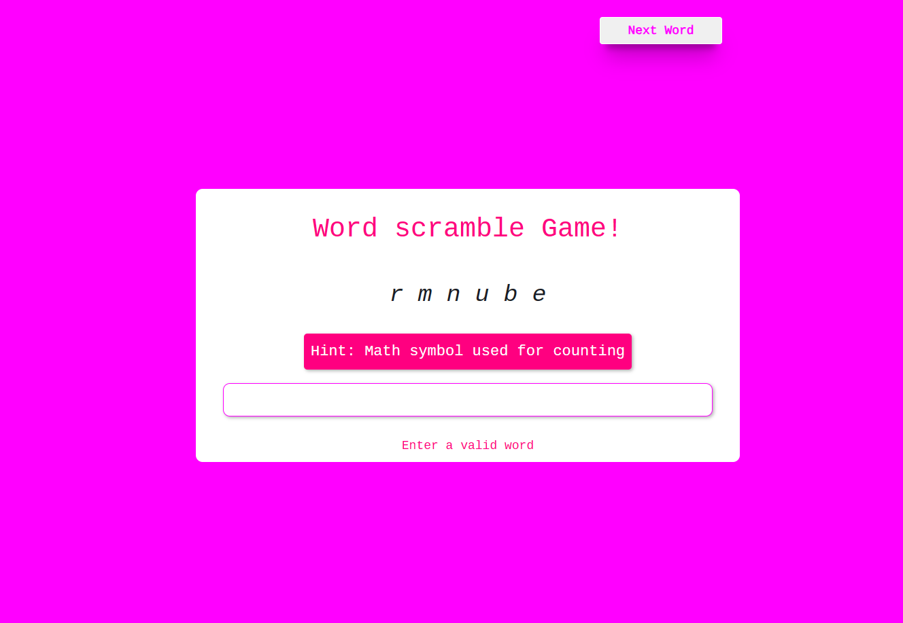
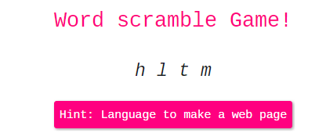
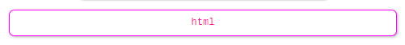
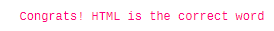

# Project: Scramble Game

Java Script is so powerful and useful to create cool applications. This is an example of a interactive game will challenge your ability to unscramble a variety of words. With ***HTML***, ***CSS***, and ***JavaScript***, we've created a fun and engaging experience in this game. Let's dive in and unscramble some words!


***Caption 1.  Viewing the User Interface of the game**

In the HTLM file there are the following elements:

* ```<button class="button-play">``` to get more word to plat.
* ```<h2><span>``` and  ```<h3><span>``` elements to show the scramble word and hint to bring help to the user to guess the word
* ```<input type="text">``` to get the word enter by the user
* ```<h4 id="feed-back">``` to show the message to bring feedback to the user
* ```<audio>``` to include sound to create better experience to the user

```HTML
<main>
        <div class="container">

            <div class="row">
                <button class="button-play">Next Word</button>
            </div>

            <div class="center">
                <form class="scramble-game container-form">
                    <h1>Word scramble Game!</h1>
                    <h2><span id="scramble-word"> </span></h2>

                    <div class="row">
                        <h3>Hint: <span id="hint"></span></h2>
                    </div>
                    <div class="row">
                        <input type="text" id="word" name="word" spellcheck="false" maxlength="10">
                    </div>
                    <div class="row">
                        <h4 id="feed-back">Enter a valid word</h4>
                    </div>
                </form>
            </div>
        </div>
```

JavaScript file contain an array with the  ***property word*** and ***hint*** hint which contains all the words and description to use in the game.  

```JavaScript
const words = [
    {
        word: "addition",
        hint: "The process of adding numbers"
    }
]
```

The index.js include the following functions:

1. ```buttonNextWords function``` to bring the next words to play

```JacaScript
onEvent('click', buttonNextWords, function () {
    init();
    showMessage('Enter a Valid word');
});
```

2.```init() function``` to initialize all the variables and chose the word to play

```JacaScript
function init() {
    let randomObj = words[Math.floor(Math.random() * words.length)];
    let wordArray = randomObj.word.split("");
    for (let i = wordArray.length - 1; i > 0; i--) {
        let j = Math.floor(Math.random() * (i + 1));
        [wordArray[i], wordArray[j]] = [wordArray[j], wordArray[i]];
    }
    scrambleWord.textContent = wordArray.join(" ");
    hintText.textContent = randomObj.hint;
    correctWord = randomObj.word.toLowerCase();;
    wordInput.value = "";
}
```

3.```addEventListener function``` to after that user press enter key validate the word typed and ```checkWord() function``` function to check if the user\'s word is correct

```JavaScript
wordInput.addEventListener("keydown", function (event) {
    if (event.key === 'Enter') {
        event.preventDefault();

        let isValid = validate();

        if (isValid) {
            msg = checkWord();
            showMessage(msg);
        }
    }
});
```

Finally, the function ```addEventListener``` includes ```audioWin.play();``` to play a sound when the user type the correct word in order to create a better experience

```JAVASCRIPT
function playSoundWin() {
    audioWin.play();
}
```

## Steps to execute the project

1. Open any browser
2. Do click in Demo link
3. A scramble word is displayed and a hint about this word



3.Introduce the word in the input and press the enter key



4.The game brings a feedback message with a sound about the result of the word typed



5.Click in the button Next word to try with other word

## Demo

Click [here](https://rosanunezrivera.github.io/scramble-game/) to test the application
